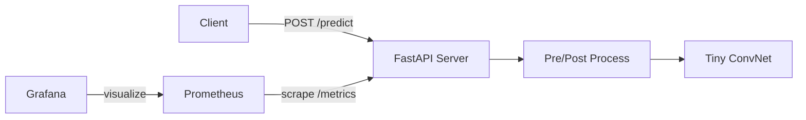

# ML Inference Starter

[](LICENSE)
[](https://github.com/gadsosa/ml-inference-starter/actions/workflows/ci.yml)
[](https://www.python.org/downloads/)

A small, containerized reference architecture for serving a PyTorch image classifier with FastAPI, Prometheus metrics, and Kubernetes manifests.

This is the kind of starter I use with startups that need to get a model from a notebook to a production-grade serving stack without committing to a heavy platform too early.

**Related work:** [`ml-security-checklist`](../ml-security-checklist) for production readiness and security checks, [`platform-scripts`](../platform-scripts) for deployment and cost tooling, [`engineering-playbook`](../engineering-playbook) for the R&D processes that keep this architecture healthy, and [`publications-and-talks`](../publications-and-talks) for essays on closing the production gap.

## Architecture



I keep the serving layer tiny so the model can be swapped without touching infrastructure. The dummy classifier trains in-memory at startup if no checkpoint exists, which makes the repo runnable end-to-end without external downloads.

## Quickstart

```bash
make install
make generate-data
make dev
```

The server is now available at [http://localhost:8000/docs](http://localhost:8000/docs).

## Development Commands

| Target | Description |
| --- | --- |
| `make install` | Install the package and dev dependencies |
| `make dev` | Run the FastAPI dev server with reload |
| `make test` | Run pytest |
| `make lint` | Lint and format-check with ruff |
| `make docker-build` | Build the Docker image |
| `make generate-data` | Generate synthetic images and a sample payload |
| `make compose-up` | Start inference, Prometheus, and Grafana |
| `make load-test` | Run a 30-second Locust load test |

## Design Decisions

- **Pure Python/PyTorch pipeline.** No model registry or cloud dependencies; everything runs locally.
- **Prometheus instrumentation.** Request count, latency histogram, and a model-version info metric are exposed on `/metrics`.
- **First-run training.** If `models/dummy_classifier.pt` is missing, `server.py` trains and caches a tiny ConvNet at startup.
- **Batch-friendly `/predict`.** Accepts either base64-encoded images or flat arrays, returning top-k probabilities.

## Kubernetes Deploy

```bash
# Requires a cluster with the NVIDIA device plugin and Prometheus Operator.
kubectl apply -f k8s/
```

The deployment requests `nvidia.com/gpu: 1`, the HPA targets 70% CPU, and the `ServiceMonitor` lets Prometheus Operator discover the `/metrics` endpoint.

## Monitoring

With `make compose-up`:

- Prometheus UI: [http://localhost:9090](http://localhost:9090)
- Grafana UI: [http://localhost:3000](http://localhost:3000) (admin / admin)

A starter dashboard for request rate, latency p99, and a GPU-utilization placeholder is mounted under `monitoring/grafana/dashboards/`.

## Production Readiness

Before this architecture sees real traffic, walk through [`PRODUCTION_READINESS.md`](PRODUCTION_READINESS.md). It covers probes, observability, model lifecycle, security, and cost.

## From Prototype to Scale

See [`docs/maturity-levels.md`](docs/maturity-levels.md) for how to evolve this starter from a notebook prototype to a production-operated service.

## Cost and Efficiency

A rough cost estimate for CPU vs. GPU inference is in [`docs/cost-estimate.md`](docs/cost-estimate.md). GPU instances are powerful but only cheaper than CPU at high utilization.

## Load Testing

Run `make load-test`, then capture the results in [`docs/load-test-report-template.md`](docs/load-test-report-template.md).

## License

This project is released under the MIT License. See [LICENSE](LICENSE) for details.
